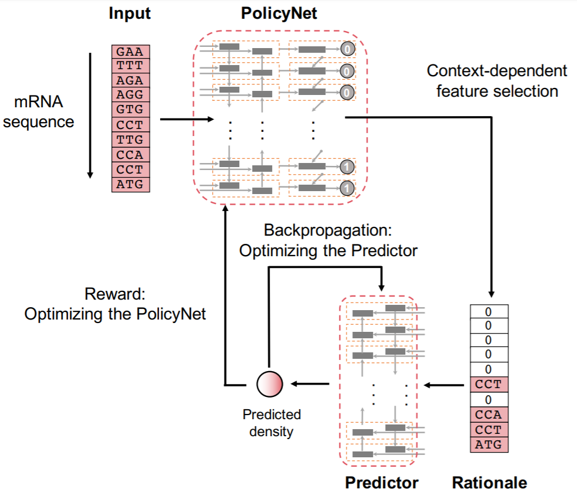

# Riboexp


This is the implementation of the paper entitled "Rationalizing Translation Elongation by Reinforcement Learning"
Here we provide servaral functions as follows:
1. Reproduce some results in our paper (cross-validation performance)
2. Train a neural network model to predict ribosome densities across a set of transcripts
3. Obtain the predicted ribosome densities for a particular gene.
4. Train a neural network model by a custom dataset

# Requirement
Riboexp is written in Python version 2.7, and requires the following libraries:
```
cuda     8.0
python   2.7
pytorch  0.3.1
numpy    1.14.3
scipy    1.0.1
```
# 1. To test Riboexp using a model that has been already trained on a particular fold.
Command:
```
python runRiboexp.py --data_path ../data/yeast --mode 1 --fold {foldnumber} --load {filename}
```
Users need to choose the foldnumber (0/1/2) and the path of the trained model. For example,
```
python runRiboexp.py --data_path ../data/yeast/ --mode 1 --load ../data/trained_models/model_yeast_useStructure_True_fold_0_nhids_512_drate_0.4_mark_mark_lam_0.0083-Jul28.11h52/best-model.pkl  --fold 0
```
The results are quickly obtained, which is consistent with our computational test.

# 2. To test Riboexp in the setting of cross-validation
Command:
```
python runRiboexp.py --data_path data/yeast --mode 2 --load0 {trainedmodel of fold 0} --load1 {trained model of fold1} --load2 {trainedmodel of fold2}
```
Example:
```
python runRiboexp.py --data_path ../data/yeast  --mode 2 --load0 ../data/trained_models/model_yeast_useStructure_True_fold_0_nhids_512_drate_0.4_mark_mark_lam_0.0083-Jul28.11h52/best-model.pkl  --load1 ../data/trained_models/model_yeast_useStructure_True_fold_1_nhids_512_drate_0.4_mark_mark_lam_0.0083-Jul28.13h32/best-model.pkl --load2  ../data/trained_models/model_yeast_useStructure_True_fold_2_nhids_512_drate_0.4_mark_mark_lam_0.0083-Jul28.15h03/best-model.pkl
```


# 3. To train Riboexp for a particular fold
Command:
```
python runRiboexp.py --data_path ../data/yeast --fold {foldnumber}
```
The training procedure will take about 1-2 hours, various from different GPU devices. This tool will save the best parameters of Riboexp accroding the performance on the held-out data (validation data).
# 4. To train Riboexp in the setting of cross-validation
Command:
```
python runRiboexp.py --data_path ../data/yeast
```
When users do not set the fold number, the algorithm will train three models for the three-fold cross-validation and save them respectively.


# 5. To train a Riboexp with only codons and nucleotides as input
Users are able to use `--no_structure` to train/analyze the data where the structure information is unavailable.
Command:
```
python runRiboexp.py --data_path ../data/yeast --no_structure
```

# 6. To derive the ribosome densities for a particular gene from a trained model
Note: This function only support the model that is trained without rna structure features.
Command and example:
```
python runRiboexp.py --data_path ../data/yeast --mode 3 --load {trainedmodel}  --fold 0 --no_structure --gene_path {genefile}
Example:
python runRiboexp.py --data_path ../data/yeast --mode 3 --fold 0 --no_structure --gene_path ../data/gene.test.txt --load ../data/trained_models/model_yeast_useStructure_False_nhids_512_drate_0.4_mark_mark_lam_0.0083-Jul28.09h34/best-model.pkl
```

# 7. To train a Riboexp by custom dataset
## Preparing your dataset
1. Create a new folder in ./data/, e.g. human.
2. Divide your data into three fold, each of them containing three file that stores training, validation, and testing data, respectively.
3. Put the name, codons, and corresponding footprint counts of genes on different lines in the file. Please refer to ./data/fold0/ for more details
4. Place the three-fold data in the human folder, named "fold0",  "fold1", and "fold2", respectively.

## Command
```
python runRiboexp.py --data_path {your dataset} --no_structure
```
If you have any questions, please feel free to contact me :)
Email: liuxg16@mails.tsinghua.edu.cn


